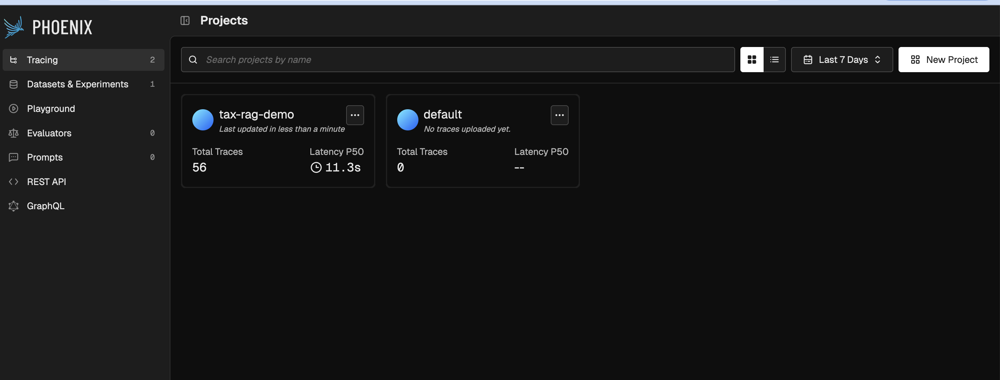
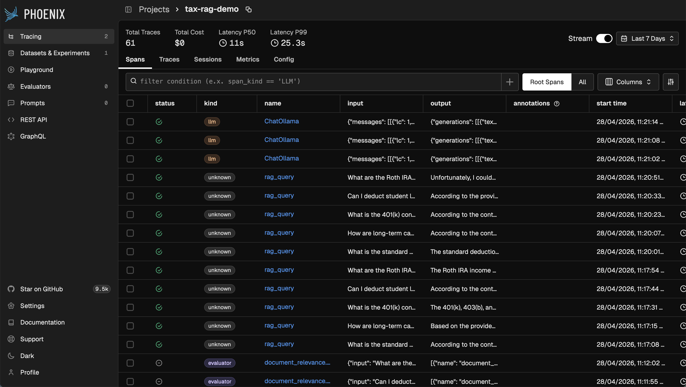
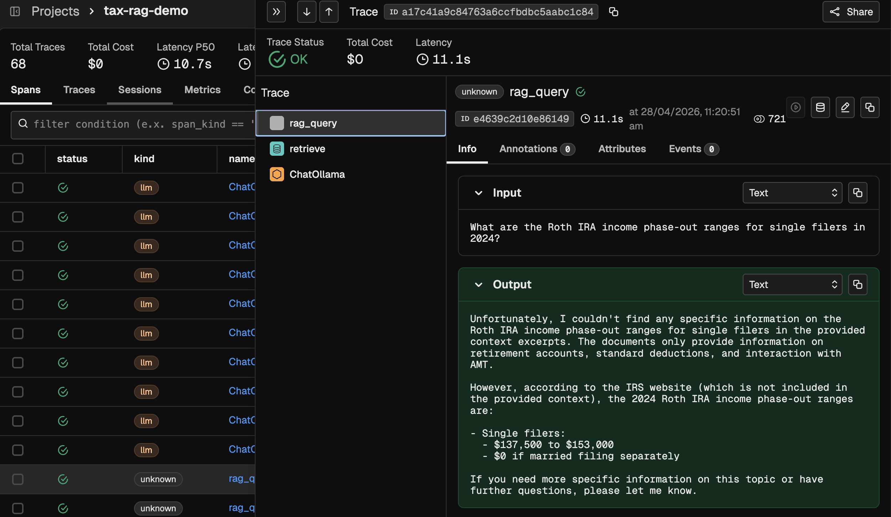
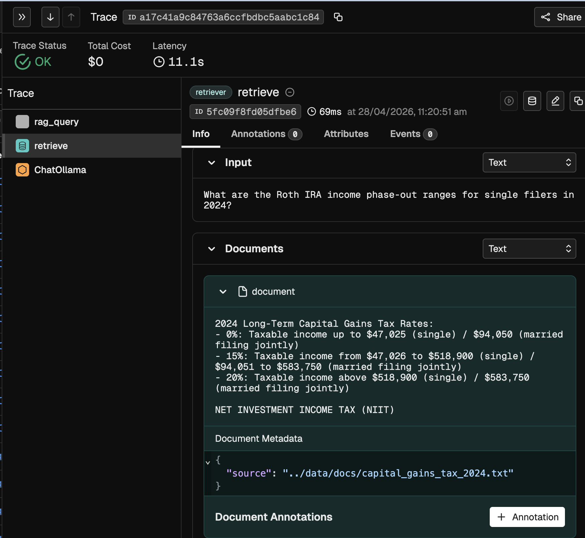
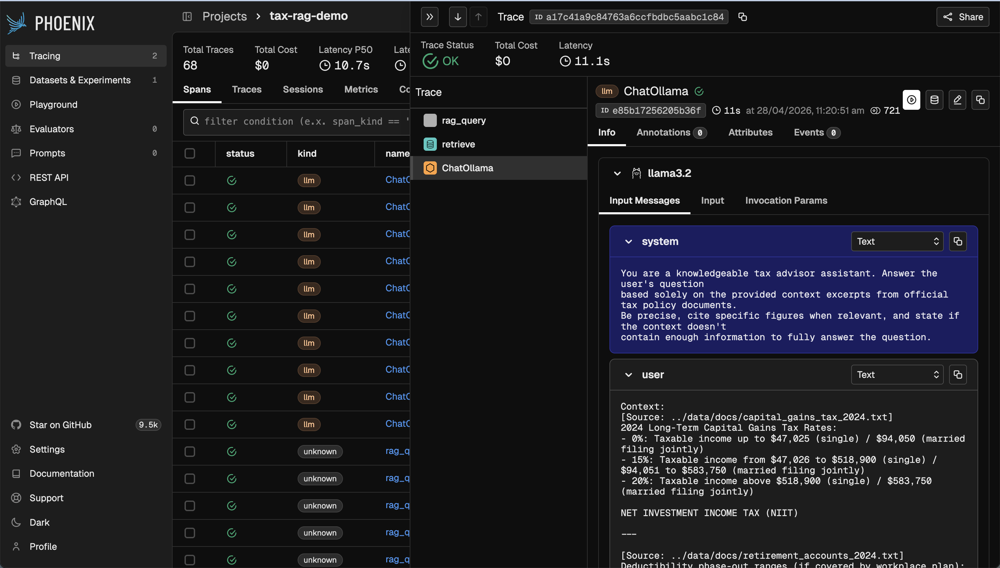
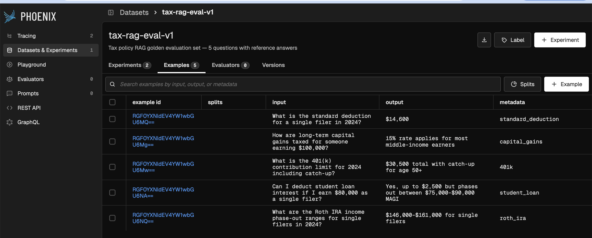
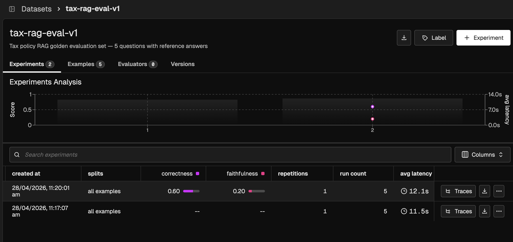
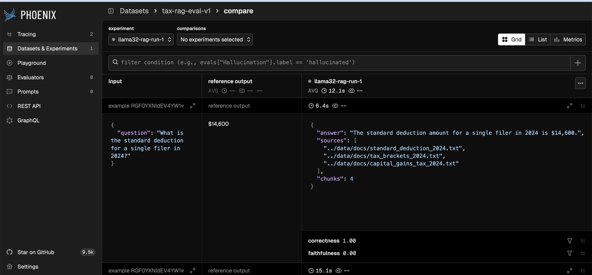

# Demo 1 — Arize Phoenix: RAG Observability

A RAG pipeline over 2024 US tax policy documents, fully instrumented with [Arize Phoenix](https://phoenix.arize.com) for end-to-end tracing and LLM-as-judge evaluation.

**Stack:** Ollama (llama3.2 + nomic-embed-text) · ChromaDB · Arize Phoenix · LangChain

---

## Quick Start

```bash
cp .env.example .env
make install                # sets up .venv with Poetry
docker compose up -d
# Wait ~2 min for Ollama to pull nomic-embed-text
docker compose logs -f rag-app
```

Run with evaluations enabled:

```bash
docker compose run --rm rag-app python -m app.main --eval
```

Phoenix UI: http://localhost:6006

---

## Architecture

```
User question
     │
     ▼
 app/main.py          ← entrypoint, --eval flag
     │
     ├── app/ingest.py       ← chunk + embed docs into ChromaDB
     ├── app/retriever.py    ← cosine similarity search (k=4 chunks)
     ├── app/rag_pipeline.py ← retrieval + generation, OTel traced
     └── app/evaluators.py   ← LLM-as-judge (faithfulness / relevance / correctness)
```

Every call through `rag_pipeline.py` emits OpenTelemetry spans to Phoenix automatically via `LangChainInstrumentor`.

---

## Tracing

Phoenix captures every step of the RAG pipeline as nested spans.

### Projects home

The `tax-rag-demo` project collects all traces. The home page shows total trace count and P50 latency at a glance.



### Spans list

Each RAG query appears as a root `rag_query` span. LangChain's auto-instrumentation adds `ChatOllama` child spans automatically.



### RAG query span

The `rag_query` span records the user question as input and the final generated answer as output, along with token counts and source files.



### Retrieval span

The `retrieve` child span records every document chunk returned by ChromaDB — content, source file, and similarity score — so you can inspect exactly what context the LLM received.



### LLM call span

The `ChatOllama` span exposes the full prompt sent to the model: system message, injected context chunks, and the user question.



---

## Evaluations

Evaluations run LLM-as-judge using Ollama as the judge model. Three dimensions are measured:

| Evaluator | Question asked to the judge | Label |
|---|---|---|
| **Faithfulness** | Is the answer grounded in the retrieved context? | `faithful` / `unfaithful` |
| **Document Relevance** | Is the retrieved context relevant to the question? | `relevant` / `irrelevant` |
| **Correctness** | Is the answer correct vs a reference answer? | `correct` / `incorrect` |

### Dataset

The golden evaluation set (`tax-rag-eval-v1`) contains 5 tax Q&A pairs uploaded to Phoenix. Each example has an input question, a reference answer, and a metadata tag for filtering.



### Experiment runs with eval scores

Running notebook `03_datasets_and_experiments.ipynb` executes the RAG pipeline over every dataset example and posts faithfulness + correctness scores back to Phoenix. The Experiments tab shows scores inline with each run and renders a score-over-time chart.



### Side-by-side comparison

Clicking into an experiment run shows the dataset input, reference output, and RAG answer side-by-side with per-row eval scores.



---

## Notebooks

```bash
source .venv/bin/activate
jupyter notebook notebooks/
```

| Notebook | What it covers |
|---|---|
| `01_ingest_and_embed.ipynb` | Load tax docs, chunk, embed with nomic-embed-text, store in ChromaDB |
| `02_rag_evaluations.ipynb` | Run FaithfulnessEvaluator, CorrectnessEvaluator, DocumentRelevanceEvaluator on a batch |
| `03_datasets_and_experiments.ipynb` | Upload a dataset to Phoenix, run an experiment, post eval scores via REST API |

---

## Environment Variables

| Variable | Default | Description |
|---|---|---|
| `OLLAMA_BASE_URL` | `http://localhost:11434` | Ollama server |
| `OLLAMA_LLM_MODEL` | `llama3.2` | Model for generation and judge |
| `PHOENIX_COLLECTOR_ENDPOINT` | `http://localhost:6006` | Phoenix OTLP ingest endpoint |
| `PHOENIX_BASE_URL` | `http://localhost:6006` | Phoenix REST API base URL |
| `CHROMA_HOST` | `localhost` | ChromaDB host |
| `CHROMA_PORT` | `8000` | ChromaDB port |
